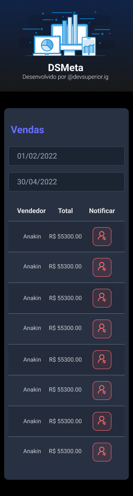
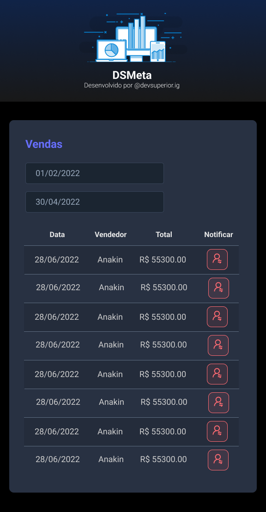

    <h1> Meta Platform </h1>

 

   

 

<h3 align = "center">
  SPRING REACT WEEK - DEVSUPERIOR
</h3>
 

| | |
|:------------------------------------------------------------------------------:|:--------------------------------------------------------------------:|
| |  |
 

    

 <a href="#theproject">The Project</a> •
 <a href="#target">Target</a> •
 <a href="#technologies">Technologies</a> •
 <a href="#route">Route</a> •

 

<h2> 📓 The Project </h2>

 Meta Platform, made at Spring React Week from DevSuperior (Teacher Nelio Alves) 

<h2> 💡 Target </h2>
Development of a platform for 

 

<h2> 🛠 Technologies </h2>
The following tools were used in building the project:  

|                     Type                     |         Tools          |                           References                           |
|:--------------------------------------------:|:----------------------:|:--------------------------------------------------------------:|
|               IDE - Front end                 |         VS CODE        |            https://code.visualstudio.com/                    |
|                IDE - Back end                 |    SPRING TOOL SUITE   |            https://code.visualstudio.com/                    |
|        Design Interface Tool                  | FIGMA  (Prototype - UX/UI)  |              https://www.figma.com/                           | 
|       Programming Language (Front end)        |          REACT         |            https://reactjs.org/                                 | 
|       Programming Language (Front end)        |       TYPESCRIPT       |            https://www.typescriptlang.org/                  | 
|       Programming Language (Back end)         |           JAVA         |            https://dev.java/learn/getting-started-with-java/     | 
|            Java Framework (Back end)          |       SPRING BOOT      |            https://spring.io/projects/spring-boot                 |
| Promise based HTTP client - browser & Node.js |          AXIOS         |            https://axios-http.com/                                 |
|                 Database                      |           SQL          |            https://graphcms.com/                                 |
|        In-memory (Java SQL) Database          |       H2 DATABASE      |            https://www.h2database.com/html/main.html        | 
|               Communication API               |         TWILIO         |            https://www.twilio.com/                                 | 
|        Tool to build frontend faster          |         VITE.JS        |            https://vitejs.dev/                                 |
|   API platform for building and using APIs    |         POSTMAN        |            https://www.postman.com/                                 |
|              Deploy Project                   |       HEROKU CLI       |            https://www.heroku.com/                                 |
 

  <h3>Backend | API</h3>
  
  
  
  
   
  <h3>Database</h3>
  
   
  <h3>IDE</h3>
  
  
   
  <h3>UX/UI</h3>
  
   
  <h3>Frontend</h3>
  
  
  
   
  <h3>Deploy</h3>
  
   

 

<h2> 🔎 Route </h2>

<ol>
    <li>Part 1 - Installing tools
      <ul>
        <li>Build the project prototype: https://www.figma.com/file/R7jageEKLtZ2fhA7HvEP8Z/DSMeta?node-id=0%3A1</li>
        <li>Install VS Code (IDE), Spring Tool Suite (IDE)</li>
        <li>Install VS Code extensions: IntelliCode, ESLint, JSX HTML <tags/> </li>
        <li>Create a Github repository</li>
      </ul>
    </li>
     
    <li>Part 2 - Static Front End
      <ul>
        <li>Create a new React project: yarn create vite frontend --template react-ts</li>
        <li>Static layout</li>
        <li>React components</li>
        <li>DatePicker: yarn add react-datepicker@4.8.0 @types/react-datepicker@4.4.2</li>
        <li>React Hook useState</li>
      </ul>
     
    <li>Part 3 - Back End</li>
      <ul>  
        <li>Create a new Spring Boot project at Spring Initializr:
            <ul>
                <li>Spring Web</li>
                <li>Spring Data JPA</li>
                <li>H2 Database</li>
                <li>Spring Security</li>
            </ul>
        </li>
        <li>Open project at Spring Toll Suite 4 (STS)</li>
        <li>Modify pom.xml: 
            <plugin>
                <groupId>org.apache.maven.plugins</groupId>
                <artifactId>maven-resources-plugin</artifactId>
                <version>3.1.0</version><!--$NO-MVN-MAN-VER$ -->
            </plugin>
        </li>
        <li>Update project: Project (right button) > Maven > Update Project (force update)</li>
        <li>Security settings for Cross-Origin Resource Sharing (CORS) and activation (initaially disabled by default)</li>
        <li>Database
            <ul>
                <li>Modeling: entities and relationships</li>
                <li>Create Sale entity</li>
                <li>Map relational-object (JPA)</li>
                <li>Set conection data with H2 database</li>
                <li>Seed at database</li>
            </ul>            
        </li>
        <li>REST API
            <ul>
                <li>Create repository</li>
                <li>Create service</li>
                <li>Create controller</li>
                <li>API REST first test</li>
            </ul>
        </li>
        <li>Data listing</li>
        <li>SMS integration
            <ul>
                <li>Twilio - Maven Dependencies 
                    <dependency>
                        <groupId>com.twilio.sdk</groupId>
                        <artifactId>twilio</artifactId>
                        <version>8.31.1</version>
                    </dependency>
                </li>
                <li>Twilio - Environmental variables 
                    twilio.sid=${TWILIO_SID} 
                    twilio.key=${TWILIO_KEY} 
                    twilio.phone.from=${TWILIO_PHONE_FROM} 
                    twilio.phone.to=${TWILIO_PHONE_TO} 
                </li>
            </ul>
        </li>
        <li>Heroku implementation
            <ul>
                <li>Create app</li>
                <li>Set environmental variables
                    <ul>
                        <li>TWILIO_SID</li>
                        <li>TWILIO_KEY</li>
                        <li>TWILIO_PHONE_FROM</li>
                        <li>TWILIO_PHONE_TO</li>
                    </ul>
                </li>
                <li>Keyboard: 
                    heroku -v 
                    heroku login 
                    heroku git:remote -a "app-name" 
                    git remote -v 
                    git subtree push --prefix backend heroku main 
                </li>
            </ul>
        </li>
      </ul>
    </li>
     
    <li>Part 4 - Integration and Deployment
      <ul>
        <li>Integrate Front end and Back end</li>
        <li>Requests with axios: yarn add axios@0.27.2</li>
        <li>React Hook useEffect</li>
        <li>Query parameters</li>
        <li>Toast message for confirmation: yarn add react-toastify@9.0.5</li>
        <li>Cloud deployment</li>
      </ul> 
    </li> 
</ol>

